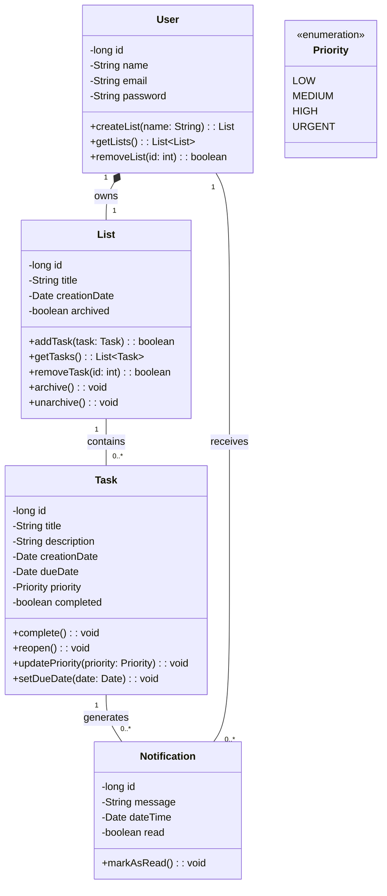

#Projeto TODO List DecolaTech2025

```mermaid
classDiagram
    class User {
        -long id
        -String name
        -String email
        -String password
        +createList(name: String): List
        +getLists(): List~List~
        +removeList(id: int): boolean
    }
    
    class List {
        -long id
        -String title
        -Date creationDate
        -boolean archived
        +addTask(task: Task): boolean
        +getTasks(): List~Task~
        +removeTask(id: int): boolean
        +archive(): void
        +unarchive(): void
    }
    
    class Task {
        -long id
        -String title
        -String description
        -Date creationDate
        -Date dueDate
        -Priority priority
        -boolean completed
        +complete(): void
        +reopen(): void
        +updatePriority(priority: Priority): void
        +setDueDate(date: Date): void
    }
    
    class Priority {
        <<enumeration>>
        LOW
        MEDIUM
        HIGH
        URGENT
    }
    

    class Notification {
        -long id
        -String message
        -Date dateTime
        -boolean read
        +markAsRead(): void
    }
    
    User "1" *-- "1" List : owns
    List "1" -- "0..*" Task : contains

    Task "1" -- "0..*" Notification : generates
    User "1" -- "0..*" Notification : receives
```
